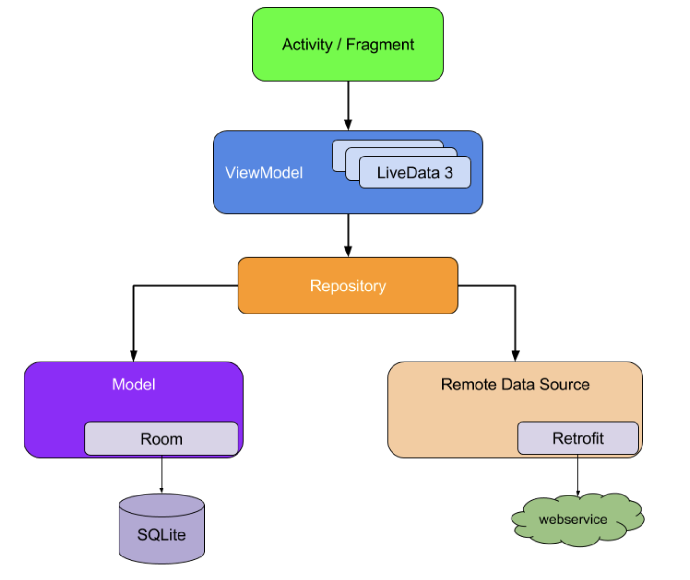
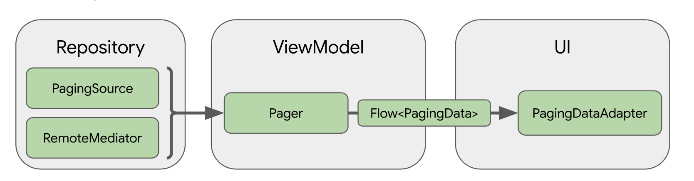

# News-Feed-App With Paging3

Daily News Reader app 📘. Learning Paging3 with MVVM,Retrofit, Kotlin Coroutines, 

# Project features 🚀

-   100% [Kotlin](https://kotlinlang.org/)
-   Kotlin Coroutines with Flow
-   Pagination with paging3 library along with header and footer with offline support
-   Clean Architecture with MVVM 
-   Modern architecture (Clean Architecture, Model-View-ViewModel)
-   Navigation, single-activity architecture with [Jetpack Navigation](https://developer.android.com/guide/navigation)
-   Cache local data with [Room Persistence Library](https://developer.android.com/topic/libraries/architecture/room)
-   ViewModel, LiveData, Lifecycle, ... with [Android Jetpack](https://developer.android.com/jetpack)
-   Dependency injection [Dagger]

#Get your api key from here  (https://newsapi.org/register)

# Screenshots

|                         |                         |                         |                         |
|        :---:            |          :---:          |        :---:            |          :---:          |
|  |  

|                         |                                       |
|       :---:             |                      :---:            |
|  |  |
